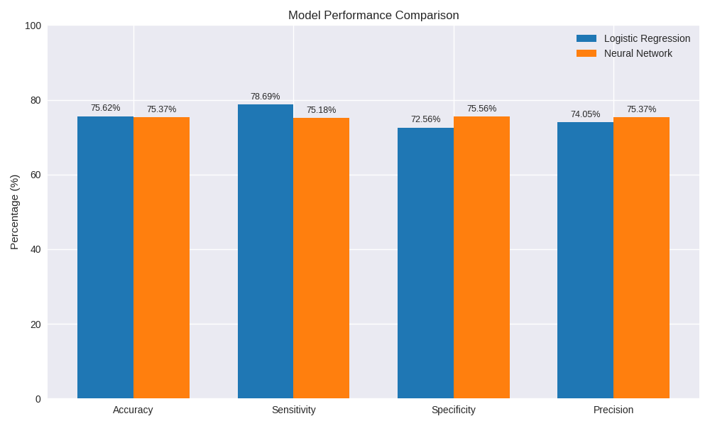
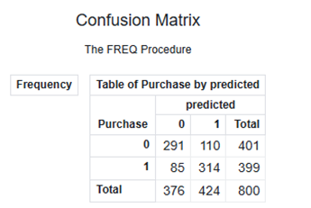
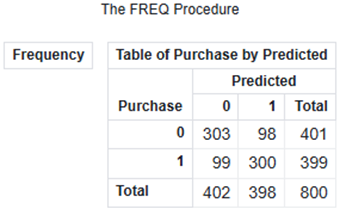

# Tayko Direct Mail Analysis  
### Reducing Wasted Catalog Spend Through Predictive Purchase Modeling 

  
  
  

---

## 📌 Table of Contents
1. [Business Problem](#-1-business-problem)  
2. [Data Overview](#-2-data-overview)  
3. [Modeling Approach](#-3-modeling-approach)  
4. [Key Insights](#-4-key-insights)  
5. [Business Impact](#-5-business-impact)  
6. [Tools & Techniques](#-6-tools--techniques)  
7. [Repository Structure](#-7-repository-structure)  
8. [Model Performance Comparison](#-8-model-performance-comparison)  
9. [Source Code & Files](#-9-source-code--files)  
10. [Author](#-10-author)  
11. [License](#-11-license)

---

## 📌 1. Business Problem
Tayko Software relies heavily on direct mail catalogs to drive customer purchases. However, mailing catalogs is expensive, and many customers never respond.

### **“Which customers are most likely to purchase if we mail them a catalog?”**

By predicting purchase likelihood, Tayko can:

- Reduce wasted marketing spend  
- Target high‑value customers  
- Improve conversion rates  
- Increase overall campaign ROI  

This project builds predictive models to support Tayko’s customer targeting strategy.

---

## 📊 2. Data Overview
The dataset includes customer demographics, purchase behavior, and engagement history.

**Target Variable:**  
- `Purchase` — whether the customer made a purchase after receiving a catalog

**Key Predictors:**  
- `Freq` — purchase frequency  
- `last_update` — recency  
- `Web` — web activity  
- `Gender`  
- `Address_RES`, `Address_US`  

The `id` variable was removed during preprocessing.

---

## 🧠 3. Modeling Approach
Two predictive models were developed and evaluated using SAS Viya:

### **Logistic Regression**
- **Accuracy:** 75.62%  
- **Sensitivity:** 78.69%  
- **Specificity:** 72.56%  
- **Precision:** 74.05%

### **Neural Network**
- **Accuracy:** 75.37%  
- **Sensitivity:** 75.18%  
- **Specificity:** 75.56%  
- **Precision:** 75.37%

---

## 🔍 4. Key Insights
- Both models perform similarly in overall accuracy (~75%).  
- For Tayko’s business goal, **precision is the most important metric**.  
- The Neural Network model achieved higher precision (75.37% vs. 74.05%), making it the stronger choice for minimizing wasted catalog spend.
- This leads to more efficient catalog targeting and higher ROI.

---

## 💼 5. Business Impact
Tayko only wants to mail catalogs to customers predicted to purchase.  
Precision tells us **how many of those predictions are correct**.

If Tayko mails **100 catalogs** to predicted purchasers:

- **Logistic Regression:** ~74 customers will buy  
- **Neural Network:** ~75 customers will buy  

### 📈 Why this matters  
A **1% improvement in precision** may seem small, but at scale it becomes significant:

- For **100,000 mailed catalogs**, a 1% lift = **1,000 additional purchases**  
- This translates to **tens of thousands of dollars in extra revenue**  
- Without increasing marketing cost  
- While reducing waste from sending catalogs to low‑probability customers  

### 💡 Business Interpretation  
The Neural Network model helps Tayko:

- Spend less on ineffective mailings  
- Increase conversions from the same marketing budget  
- Improve customer targeting strategy  
- Boost profitability of future catalog campaigns  

---

## 🛠️ 6. Tools & Techniques
Built end-to-end in SAS Viya — from raw data cleaning through model evaluation and business interpretation — to support a real direct mail targeting decision.
- **SAS Viya**  
- Data cleaning & preprocessing  
- Logistic Regression modeling  
- Neural Network modeling  
- Confusion Matrix evaluation  
- Business interpretation & ROI framing  

---

## 📊 7. Model Performance Comparison

---

## ✅ 8. Key Takeaway
This analysis identified a model that can reduce ineffective catalog mailings while improving purchase conversions — without increasing spend.  
The Neural Network model offers the best precision and is recommended for deployment.

---

## 📜 9. Source Code & Files

- **SAS Model Code:**  
  [tayko_purchase_prediction.sas](codes/tayko_purchase_prediction.sas)

- **Dataset:**  
  [TaykoSoftware.csv](data/TaykoSoftware.csv)

- **Model Outputs (Confusion Matrices):**

  ### Logistic Regression  
  

  ### Neural Network  
  

- **Project Report (DOCX):**  
  [HW4_DirectMailing_Report.docx](docs/HW4_DirectMailing_Report.docx)

---

## 👤 10. Author  
**Minh Nguyen**  
Bachelor of Science in Management Information Systems (MIS)  
Cybersecurity Analytics & Management Concentration  
Oakland University – Class of 2026  

[LinkedIn](https://www.linkedin.com/in/minh-nguyen-mis/) · [GitHub](https://github.com/mhnguyen1807)

---

## 📄 11. License  
This project is licensed under the **MIT License**.
